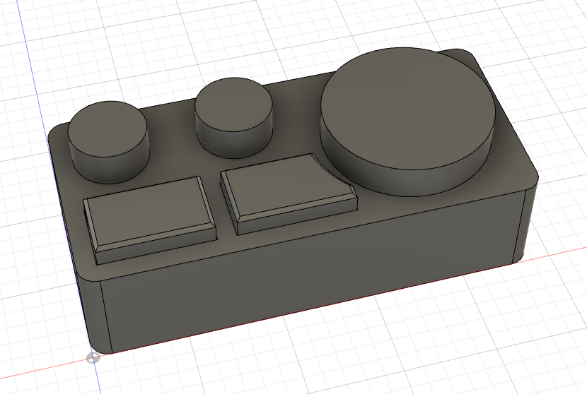
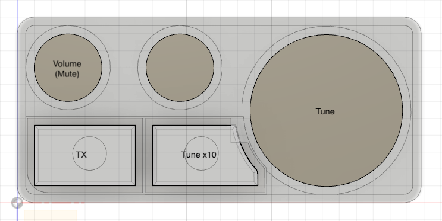

# dj-midi-controller

this is a project to build a dj style controller for use with SDR-Console softare used by ham radio operators

## data files
there are three folders :
- eagle for the pcb design
- arduino for the firmware
- 3d for the encloser

## sdr-console configuration
you can open the midi settings and set each fucntion as you like, or use my presets

## Button Functions

encoder 1 is the frequency tuning
if you press button 2 (the odd shaped one) it will tune at 10x speed
encoder 2 is not currently used 
encoder 3 is volume control, if you press it - it will mute the reciever
button 1 toggles RX/TX

if you want to change button2 to a normal seperate function, check the arduino code

